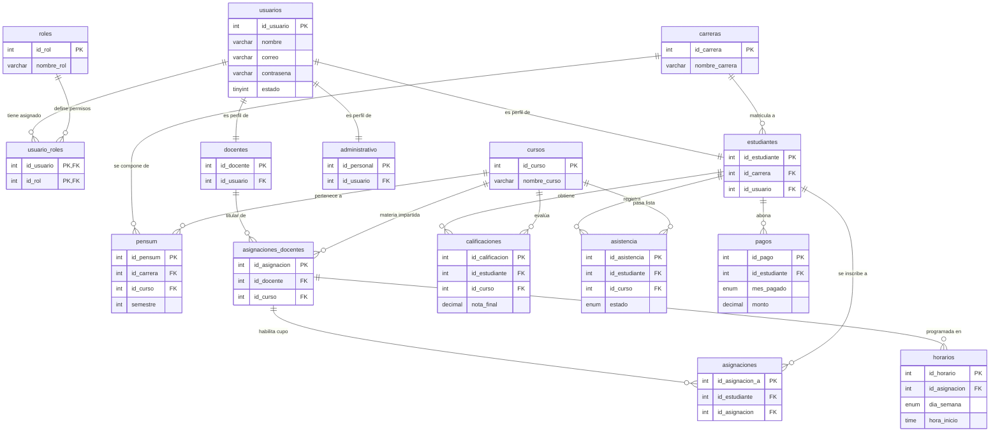

```mermaid
erDiagram
    %% ==========================================
    %% 1. GESTIÓN DE IDENTIDAD Y ACCESOS
    %% ==========================================
    usuarios {
        int id_usuario PK
        varchar nombre
        varchar correo
        varchar contrasena
        tinyint estado
    }
    roles {
        int id_rol PK
        varchar nombre_rol
    }
    usuario_roles {
        int id_usuario PK, FK
        int id_rol PK, FK
    }

    usuarios ||--o{ usuario_roles : "tiene asignado"
    roles ||--o{ usuario_roles : "define permisos"

    %% ==========================================
    %% 2. PERFILES (Herencia lógica de usuarios)
    %% ==========================================
    estudiantes {
        int id_estudiante PK
        int id_carrera FK
        int id_usuario FK
    }
    docentes {
        int id_docente PK
        int id_usuario FK
    }
    administrativo {
        int id_personal PK
        int id_usuario FK
    }

    usuarios ||--|| estudiantes : "es perfil de"
    usuarios ||--|| docentes : "es perfil de"
    usuarios ||--|| administrativo : "es perfil de"

    %% ==========================================
    %% 3. CATÁLOGO ACADÉMICO
    %% ==========================================
    carreras {
        int id_carrera PK
        varchar nombre_carrera
    }
    cursos {
        int id_curso PK
        varchar nombre_curso
    }
    pensum {
        int id_pensum PK
        int id_carrera FK
        int id_curso FK
        int semestre
    }

    carreras ||--o{ estudiantes : "matricula a"
    carreras ||--o{ pensum : "se compone de"
    cursos ||--o{ pensum : "pertenece a"

    %% ==========================================
    %% 4. MOTOR TRANSACCIONAL (Asignaciones)
    %% ==========================================
    asignaciones_docentes {
        int id_asignacion PK
        int id_docente FK
        int id_curso FK
    }
    horarios {
        int id_horario PK
        int id_asignacion FK
        enum dia_semana
        time hora_inicio
    }
    asignaciones {
        int id_asignacion_a PK
        int id_estudiante FK
        int id_asignacion FK
    }

    docentes ||--o{ asignaciones_docentes : "titular de"
    cursos ||--o{ asignaciones_docentes : "materia impartida"
    asignaciones_docentes ||--o{ horarios : "programada en"
    asignaciones_docentes ||--o{ asignaciones : "habilita cupo"
    estudiantes ||--o{ asignaciones : "se inscribe a"

    %% ==========================================
    %% 5. CONTROL ACADÉMICO Y FINANCIERO
    %% ==========================================
    calificaciones {
        int id_calificacion PK
        int id_estudiante FK
        int id_curso FK
        decimal nota_final
    }
    asistencia {
        int id_asistencia PK
        int id_estudiante FK
        int id_curso FK
        enum estado
    }
    pagos {
        int id_pago PK
        int id_estudiante FK
        enum mes_pagado
        decimal monto
    }

    estudiantes ||--o{ calificaciones : "obtiene"
    cursos ||--o{ calificaciones : "evalúa"
    estudiantes ||--o{ asistencia : "registra"
    cursos ||--o{ asistencia : "pasa lista"
    estudiantes ||--o{ pagos : "abona"
```
