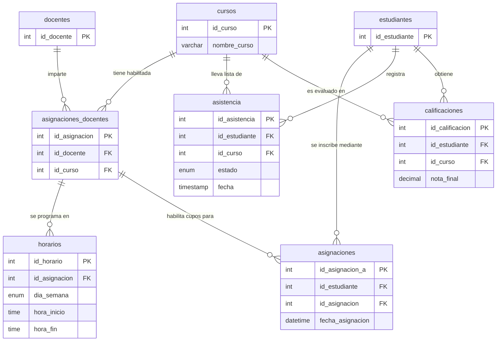

```mermaid
erDiagram
    %% ==========================================
    %% ENTIDADES REFERENCIALES
    %% ==========================================
    estudiantes {
        int id_estudiante PK
    }
    docentes {
        int id_docente PK
    }

    %% ==========================================
    %% NÚCLEO ACADÉMICO
    %% ==========================================
    cursos {
        int id_curso PK
        varchar nombre_curso
    }

    asignaciones_docentes {
        int id_asignacion PK
        int id_docente FK
        int id_curso FK
    }

    horarios {
        int id_horario PK
        int id_asignacion FK
        enum dia_semana
        time hora_inicio
        time hora_fin
    }

    %% Relaciones: Un docente imparte un curso en horarios específicos
    docentes ||--o{ asignaciones_docentes : "imparte"
    cursos ||--o{ asignaciones_docentes : "tiene habilitada"
    asignaciones_docentes ||--o{ horarios : "se programa en"

    %% ==========================================
    %% MATRICULACIÓN
    %% ==========================================
    asignaciones {
        int id_asignacion_a PK
        int id_estudiante FK
        int id_asignacion FK
        datetime fecha_asignacion
    }

    %% Relaciones: El estudiante se inscribe a la clase del docente
    asignaciones_docentes ||--o{ asignaciones : "habilita cupos para"
    estudiantes ||--o{ asignaciones : "se inscribe mediante"

    %% ==========================================
    %% EJECUCIÓN: ASISTENCIA Y NOTAS
    %% ==========================================
    asistencia {
        int id_asistencia PK
        int id_estudiante FK
        int id_curso FK
        enum estado
        timestamp fecha
    }

    calificaciones {
        int id_calificacion PK
        int id_estudiante FK
        int id_curso FK
        decimal nota_final
    }

    %% Relaciones: Evaluación del estudiante vinculada al curso
    estudiantes ||--o{ asistencia : "registra"
    cursos ||--o{ asistencia : "lleva lista de"
    
    estudiantes ||--o{ calificaciones : "obtiene"
    cursos ||--o{ calificaciones : "es evaluado en"
```
